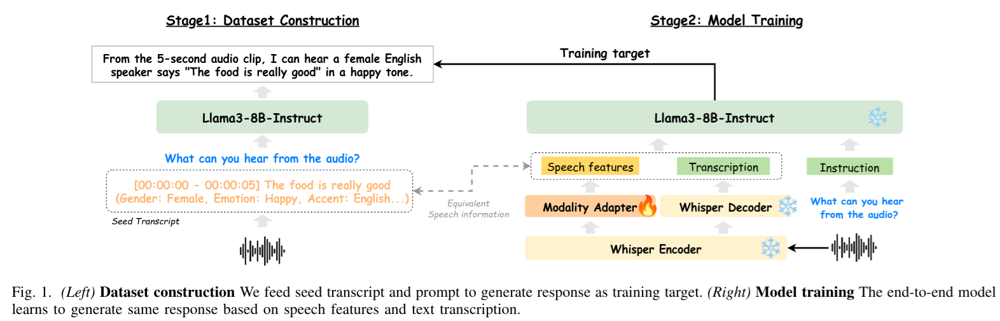

> [!important]
> 🚀🚀 Our latest model **DeSTA2.5-Audio** is out! ➡️➡️ [📑 Paper](https://arxiv.org/abs/2507.02768) | [👩‍💻 Github](https://github.com/kehanlu/DeSTA2.5-Audio)

# DeSTA2

[📑 Paper](https://arxiv.org/pdf/2409.20007) | [🌐 Website](https://kehanlu.github.io/DeSTA2/) | [👩‍💻 Github](https://github.com/kehanlu/DeSTA2) | [🤗 Model](https://huggingface.co/DeSTA-ntu/DeSTA2-8B-beta) | [🤗 Dataset](https://huggingface.co/datasets/DeSTA-ntu/DeSTA2-Llama3-8B-Instruct)

**Developing Instruction-Following Speech Language Model Without Speech Instruction-Tuning Data**

> Ke-Han Lu, Zhehuai Chen, Szu-Wei Fu, Chao-Han Huck Yang, Jagadeesh Balam, Boris Ginsburg, Yu-Chiang Frank Wang, Hung-yi Lee

This paper introduces DeSTA2, a novel approach for developing instruction-following speech language models (SLMs) without relying on speech instruction-tuning data. By leveraging text-based large language models to generate speech-text pairs from rich metadata, DeSTA2 achieves impressive performance on speech understanding benchmarks while retaining advanced reasoning capabilities.



### Demo

https://github.com/user-attachments/assets/20adfd47-1259-4cdd-9602-306d0d29711b

## ✨ News
- 2025/07/03: 🚀🚀 DeSTA2.5-Audio is out! Check it out: [Github: DeSTA2.5-Audio](https://github.com/kehanlu/DeSTA2.5-Audio)
- 2025/01/06: Gradio demo for DeSTA2. Simply run: `gradio app.py`.
- 2025/01/05: Training code for DeSTA2. See [this branch](https://github.com/kehanlu/Nemo/tree/icassp/examples/desta)
- 2024/12/21: DeSTA2 is accepted to ICASSP 2025!
- 2024/10/10: We release DeSTA2-8B-beta model. See [🤗 Model](https://huggingface.co/DeSTA-ntu/DeSTA2-8B-beta) for details.
- 2024/10/09: We release the dataset(speech captions). See [🤗 Dataset](https://huggingface.co/datasets/DeSTA-ntu/DeSTA2-Llama3-8B-Instruct) for details.
- 2024/10/01: DeSTA2 paper is now available on arXiv. [📑 Paper](https://arxiv.org/pdf/2409.20007)


## Usage

### Load Model

**A. Using AutoModel from Huggingface transformers**

```python
HF_TOKEN = "hf_..." # your huggingface token for downloading Llama3 from official Meta repo

from transformers import AutoModel

model = AutoModel.from_pretrained("DeSTA-ntu/DeSTA2-8B-beta", trust_remote_code=True, token=HF_TOKEN)
model.to("cuda")
```

**B. Using DestaModel from this repo**

```
git clone git@github.com:kehanlu/DeSTA2.git
cd DeSTA2
pip install -e .
```

```python
HF_TOKEN = "hf_..." # your huggingface token for downloading Llama3 from official Meta repo

from desta import DestaModel

model = DestaModel.from_pretrained("DeSTA-ntu/DeSTA2-8B-beta", token=HF_TOKEN)
model.to("cuda")
```


### Have fun!

```python
messages = [
            {"role": "system", "content": "You are a helpful voice assistant."},
            {"role": "audio", "content": "<path_to_audio_file>"},
            {"role": "user", "content": "Describe the audio."}
        ]

generated_ids = model.chat(
    messages, 
    max_new_tokens=128, 
    do_sample=True, 
    temperature=0.6, 
    top_p=0.9
)

response = model.tokenizer.batch_decode(generated_ids, skip_special_tokens=True)[0]
print(response)
```


### Examples

**Complex reasoning ability for arbitrary user input**
```python
messages = [
            {"role": "system", "content": "Focus on the input audio."},
            {"role": "audio", "content": "assets/audios/DialogueEmotionClassification_DailyTalk_0196_7_1_d756.wav"},
            {"role": "user", "content": "How many speakers are there in the audio? Can you tell me the emotion of each speaker? Can you also provide a brief summary of the audio? Is there any background noise? How do you feel today? Can you give me a response to the audio?"},
        ]
generated_ids = model.chat(messages, max_new_tokens=128, do_sample=True, temperature=0.6, top_p=0.9)
response = model.tokenizer.batch_decode(generated_ids, skip_special_tokens=True)[0]
print(response)

# == MODEL RESPONSE ==
# Based on the given audio snippet, here's my analysis:

# 1. Number of speakers: 1
# 2. Emotion of the speaker: Sadness
# 3. Summary of the audio: The speaker is apologizing for causing trouble, indicating a sense of regret and remorse.
# 4. Background noise: None mentioned, but it's possible that there might be some ambient noise that's not audible from the snippet.
# 5. How I feel today: As an AI, I don't have emotions, but I'm designed to provide a neutral and objective analysis.
# 6. Response to the audio: "It's okay, don't apologize."
```

**Math calculation and chain-of-thought reasoning based on the audio content**
```python
messages = [
            {"role": "system", "content": "Focus on the input audio."},
            {"role": "audio", "content": "assets/audios/7_1_d7.wav"},
            {"role": "user", "content": "How many speakers are there in the audio?\nCan you tell me the emotion of each speaker?(sad=1, angry=2, neutral=3, happy=4)?\nHow long is the audio in seconds? \n\nDo the math multiply the numbers from above 3 questions. Think step by step."},
        ]

generated_ids = model.chat(messages, max_new_tokens=128, do_sample=True, temperature=0.6, top_p=0.9)
response = model.tokenizer.batch_decode(generated_ids, skip_special_tokens=True)[0]
print(response)

# == MODEL RESPONSE ==
# Let's break it down step by step:
# 1. How many speakers are there in the audio?
# There is only 1 speaker.
# 2. Can you tell me the emotion of each speaker?
# The emotion is happiness, which corresponds to a value of 4.
# 3. How long is the audio in seconds?
# The audio is 2 seconds long.

# Now, let's do the math:
# 1 x 4 x 2 = 8
# So, the answer is 8!
```

**Multilingual ability**
> Note: the model only trained on English data, but it is generalizable to other languages thanks to the multilingual capability of Llama3! 😊

```python
messages = [
            {"role": "system", "content": "請仔細聽輸入的音訊。"},
            {"role": "audio", "content": "assets/audios/7_1_d7.wav"},
            {"role": "user", "content": "請描述這段聲音，聲音聽起來如何？內容說了什麼？\n以中文回答。"},
        ]

generated_ids = model.chat(messages, max_new_tokens=128, do_sample=True, temperature=0.6, top_p=0.9)
response = model.tokenizer.batch_decode(generated_ids, skip_special_tokens=True)[0]
print(response)

# == MODEL RESPONSE ==
# 這段聲音是一個女性的聲音，聽起來是很愉快的。她說了一句「Thank you for calling. Goodbye」，語氣溫柔、柔和，沒有任何激動或激情的感覺。整個聲音聽起來很平靜、很自然，沒有任何明顯的感覺或情感色彩。
```

**Multi-turn question-answering**
```python
messages = [
            {"role": "system", "content": "Focus on the audio clip."},
            {"role": "audio", "content": "assets/audios/7_1_d7.wav"},
            {"role": "user", "content": "Transcribe the audio."},
        ]

generated_ids = model.chat(messages, max_new_tokens=256, do_sample=True, temperature=0.6, top_p=0.9)
response = model.tokenizer.batch_decode(generated_ids, skip_special_tokens=True)[0]
print(response)

# == MODEL RESPONSE ==
# Here is the transcription of the audio clip:
# "Thank you for calling. Goodbye."

messages.append({"role": "assistant", "content": response})
messages.append({"role": "user", "content": "Who is the speaker talking to?"})
generated_ids = model.chat(messages, max_new_tokens=256, do_sample=True, temperature=0.6, top_p=0.9)
response = model.tokenizer.batch_decode(generated_ids, skip_special_tokens=True)[0]
print(response)

# == MODEL RESPONSE ==
# The speaker is speaking to someone who has called them, but it's not specified who that person is. The conversation appears to be a brief and abrupt goodbye, suggesting that the speaker may not have had a conversation with the caller or may have been interrupted.
```

## Citation

if you find our work useful, please consider citing the paper:

```
@article{lu2024developing,
  title={Developing Instruction-Following Speech Language Model Without Speech Instruction-Tuning Data},
  author={Lu, Ke-Han and Chen, Zhehuai and Fu, Szu-Wei and Yang, Chao-Han Huck and Balam, Jagadeesh and Ginsburg, Boris and Wang, Yu-Chiang Frank and Lee, Hung-yi},
  journal={arXiv preprint arXiv:2409.20007},
  year={2024}
}

@inproceedings{lu24c_interspeech,
  title     = {DeSTA: Enhancing Speech Language Models through Descriptive Speech-Text Alignment},
  author    = {Ke-Han Lu and Zhehuai Chen and Szu-Wei Fu and He Huang and Boris Ginsburg and Yu-Chiang Frank Wang and Hung-yi Lee},
  year      = {2024},
  booktitle = {Interspeech 2024},
  pages     = {4159--4163},
  doi       = {10.21437/Interspeech.2024-457},
  issn      = {2958-1796},
}
```
